# Autoencoder Implementation Report
## FFHQ Dataset

**Author:** Ameer George Abdallah  
**Date:** November 27, 2025

---

## Table of Contents

1. [Introduction](#introduction)
2. [Part A: Skip-Connection Autoencoders](#part-a-skip-connection-autoencoders)
3. [Part B: Deep ResNet Autoencoders with LPIPS](#part-b-deep-resnet-autoencoders-with-lpips)
4. [Part C: Variational Autoencoders (VAE)](#part-c-variational-autoencoders-vae)
5. [Part D: Deep VAE with Attention](#part-d-deep-vae-with-attention)
6. [Conclusion](#conclusion)

---

## Introduction

This report presents the implementation and evaluation of multiple autoencoder architectures trained on the FFHQ (Flickr-Faces-HQ) dataset. The goal is to achieve high-quality image reconstruction while maintaining an informative latent space representation.

### Dataset

- **Dataset**: FFHQ (Flickr-Faces-HQ)
- **Location**: `/home/ML_courses/03683533_2025/dataset`
- **Image Size**: 256×256 pixels
- **Training Set**: 39,000 images
- **Validation Set**: 1,000 images (first 1K)

### Evaluation Metrics

- **L1 Loss**: Mean Absolute Error between reconstruction and input
- **PSNR**: Peak Signal-to-Noise Ratio (dB)
- **LPIPS**: Learned Perceptual Image Patch Similarity (when applicable)
- **KL Divergence**: For VAE models, measures latent space regularization

---

## Part A: Skip-Connection Autoencoders

This section explores U-Net style autoencoders with skip connections, testing different normalization techniques, activations, and network widths.

### Model A1: Skip ConvAE (Depth 10)

#### Architecture
- **Model Class**: `SkipConvAutoencoder`
- **Base Channels**: 32
- **Number of Blocks**: 4
- **Latent Dimension**: 256 (flattened)
- **Normalization**: GroupNorm
- **Activation**: SiLU (Swish)
- **Output Activation**: Tanh

#### Hyperparameters

| Parameter | Value |
|-----------|-------|
| Epochs | 60 |
| Batch Size | 8 |
| Learning Rate | 2e-4 |
| Optimizer | Adam |
| Loss Function | L1 Loss |

#### Loss Curves

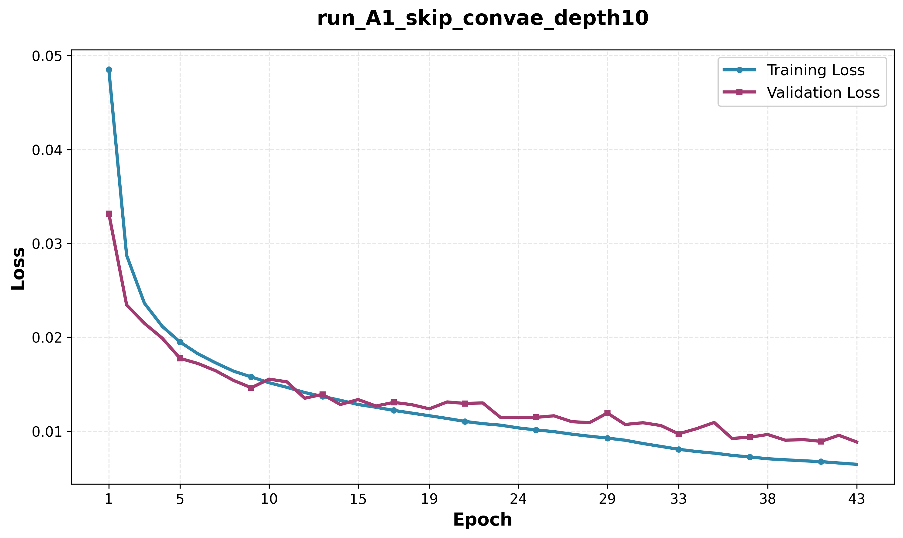

---

### Model A2: Skip ConvAE (BatchNorm)

#### Architecture
- **Model Class**: `SkipConvAutoencoder`
- **Base Channels**: 32
- **Number of Blocks**: 4
- **Latent Dimension**: 256
- **Normalization**: BatchNorm
- **Activation**: SiLU
- **Output Activation**: Tanh

#### Hyperparameters

| Parameter | Value |
|-----------|-------|
| Epochs | 60 |
| Batch Size | 8 |
| Learning Rate | 2e-4 |
| Optimizer | Adam |
| Loss Function | L1 Loss |

#### Loss Curves

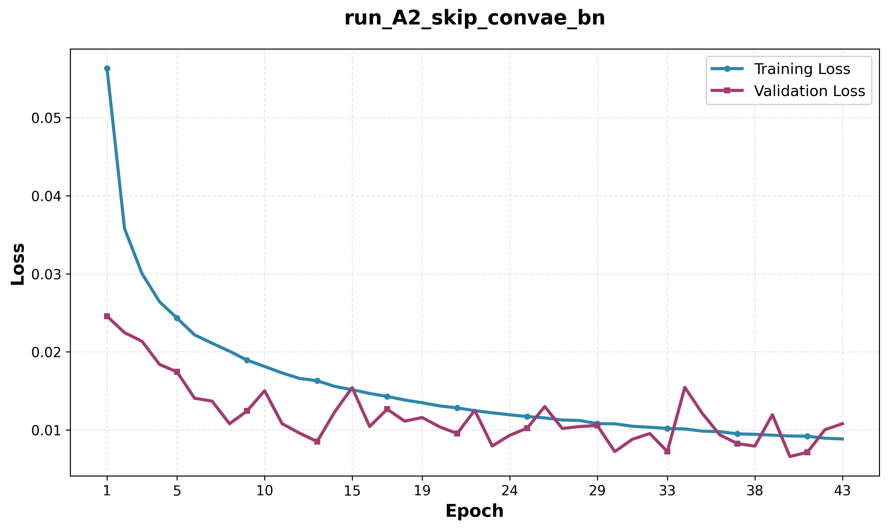

---

### Model A3: Skip ConvAE (LeakyReLU)

#### Architecture
- **Model Class**: `SkipConvAutoencoder`
- **Base Channels**: 32
- **Number of Blocks**: 4
- **Latent Dimension**: 256
- **Normalization**: GroupNorm
- **Activation**: LeakyReLU (slope=0.2)
- **Output Activation**: Tanh

#### Hyperparameters

| Parameter | Value |
|-----------|-------|
| Epochs | 60 |
| Batch Size | 8 |
| Learning Rate | 2e-4 |
| Optimizer | Adam |
| Loss Function | L1 Loss |

#### Loss Curves

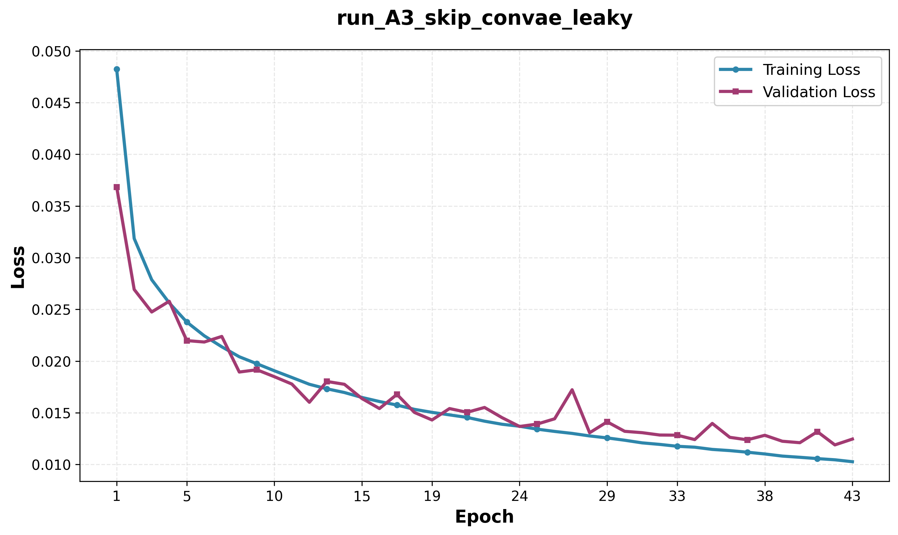

---

### Model A4: Skip ConvAE (Wide)

#### Architecture
- **Model Class**: `SkipConvAutoencoder`
- **Base Channels**: 48 (wider network)
- **Number of Blocks**: 4
- **Latent Dimension**: 256
- **Normalization**: GroupNorm
- **Activation**: SiLU
- **Output Activation**: Tanh

#### Hyperparameters

| Parameter | Value |
|-----------|-------|
| Epochs | 60 |
| Batch Size | 8 |
| Learning Rate | 2e-4 |
| Optimizer | Adam |
| Loss Function | L1 Loss |

#### Loss Curves

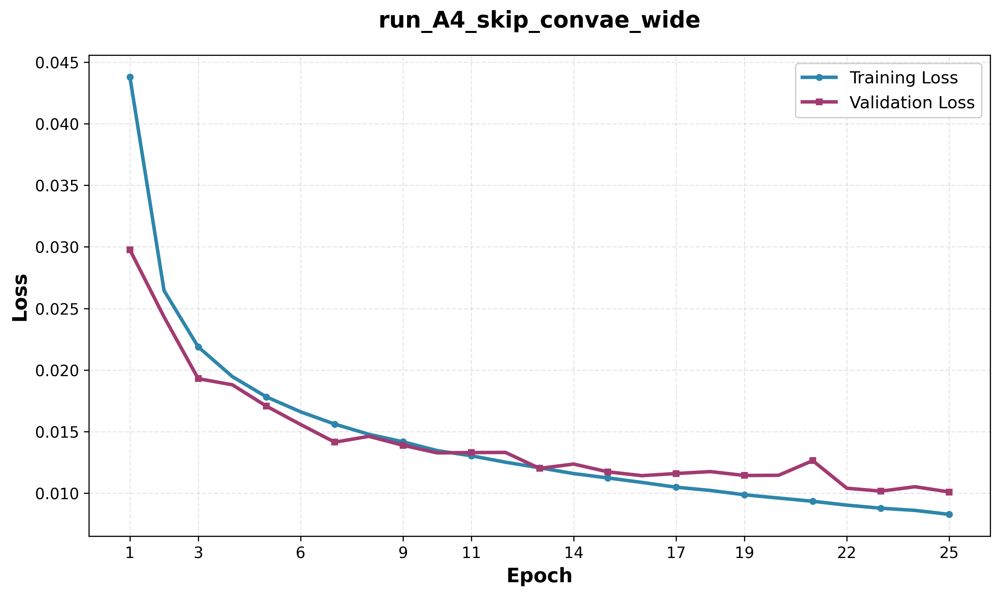

---

## Part B: Deep ResNet Autoencoders with LPIPS

This section explores deep ResNet-based autoencoders with varying LPIPS (Learned Perceptual Image Patch Similarity) weights to improve perceptual quality.

### Model B1: ResNet AE (Baseline)

#### Architecture
- **Model Class**: `DeepResNetAutoencoder`
- **Latent Dimension**: 256
- **Encoder**: 5 downsampling blocks with ResBlocks
- **Decoder**: 5 upsampling blocks with ResBlocks
- **Normalization**: BatchNorm
- **Activation**: LeakyReLU (0.2)

#### Hyperparameters

| Parameter | Value |
|-----------|-------|
| Epochs | 30 |
| Batch Size | 8 |
| Learning Rate | 2e-4 |
| Optimizer | Adam |
| Loss Function | L1 Loss |
| LPIPS Weight | 0.0 (None) |

#### Loss Curves

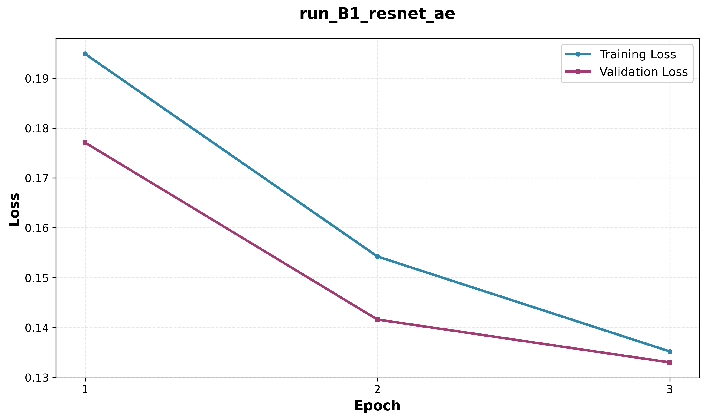

---

### Model B2: ResNet + LPIPS Ablation Study

We conducted an ablation study on LPIPS weight to determine its effect on reconstruction quality.

#### Model B2.1: LPIPS Weight = 0.0

**Hyperparameters**

| Parameter | Value |
|-----------|-------|
| Epochs | 30 |
| Batch Size | 8 |
| Learning Rate | 2e-4 |
| Optimizer | Adam |
| Loss Function | L1 Loss |
| LPIPS Weight | 0.0 |
| LPIPS Network | AlexNet |

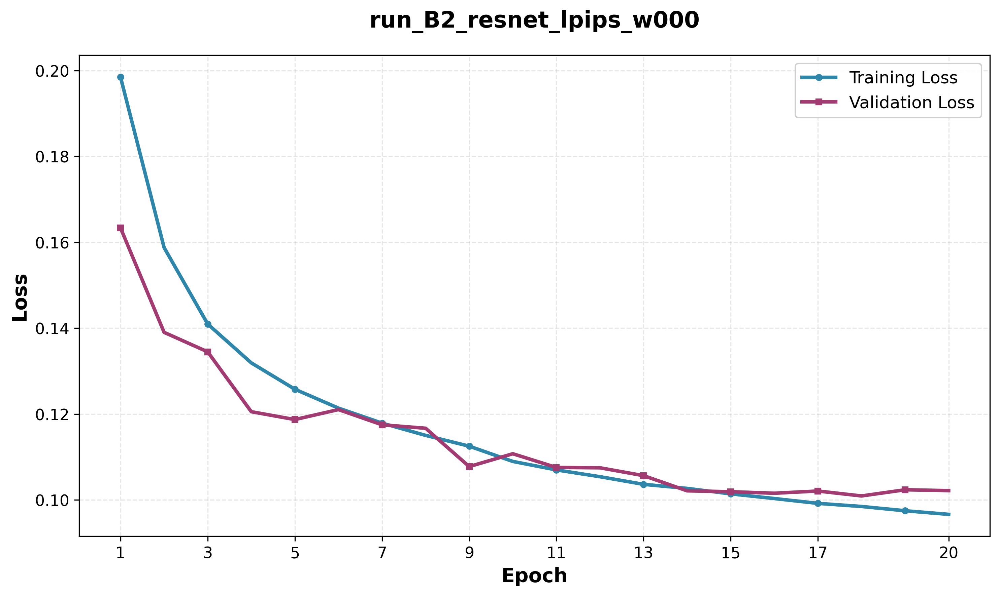

---

#### Model B2.2: LPIPS Weight = 0.05

**Hyperparameters**

| Parameter | Value |
|-----------|-------|
| Epochs | 30 |
| Batch Size | 8 |
| Learning Rate | 2e-4 |
| Optimizer | Adam |
| Loss Function | L1 + LPIPS |
| LPIPS Weight | 0.05 |
| LPIPS Network | AlexNet |

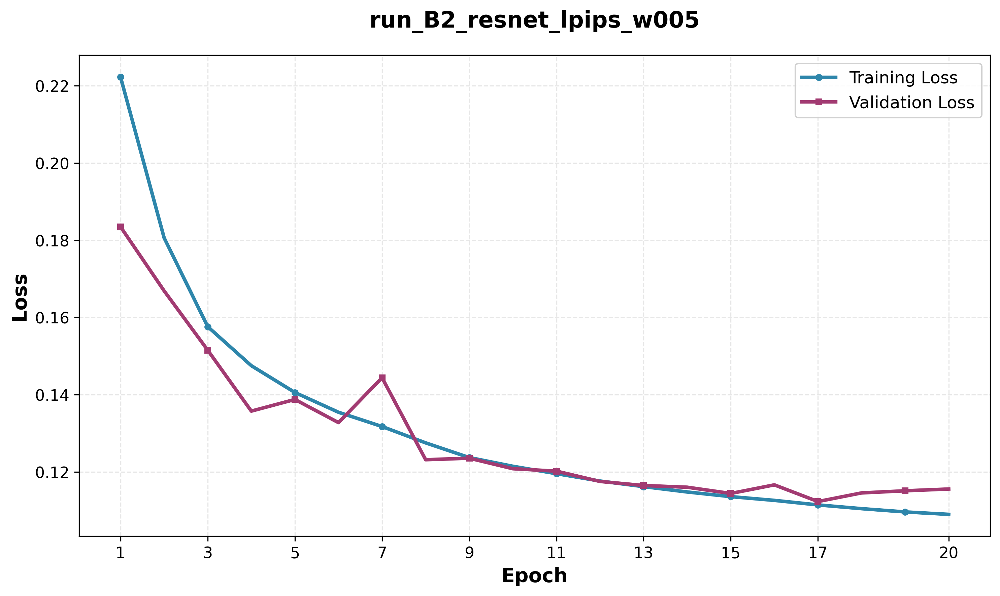

---

#### Model B2.3: LPIPS Weight = 0.075

**Hyperparameters**

| Parameter | Value |
|-----------|-------|
| Epochs | 30 |
| Batch Size | 8 |
| Learning Rate | 2e-4 |
| Optimizer | Adam |
| Loss Function | L1 + LPIPS |
| LPIPS Weight | 0.075 |
| LPIPS Network | AlexNet |

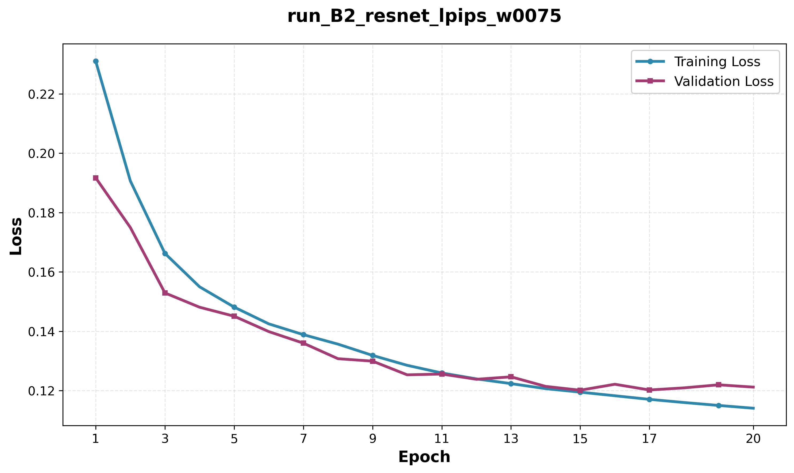

---

#### Model B2.4: LPIPS Weight = 0.10

**Hyperparameters**

| Parameter | Value |
|-----------|-------|
| Epochs | 30 |
| Batch Size | 8 |
| Learning Rate | 2e-4 |
| Optimizer | Adam |
| Loss Function | L1 + LPIPS |
| LPIPS Weight | 0.10 |
| LPIPS Network | AlexNet |

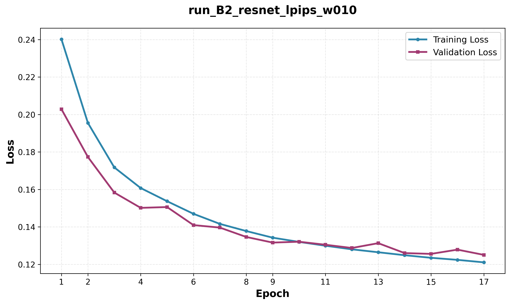

---

## Part C: Variational Autoencoders (VAE)

This section explores VAE models with different KL divergence weights and architectural variations to balance reconstruction quality with latent space regularization.

### Model C1: VAE (Small Beta)

#### Architecture
- **Model Class**: `VAE`
- **Latent Dimension**: 256
- **Base Channels**: 32
- **Encoder**: 4 convolutional layers with BatchNorm
- **Decoder**: 4 transposed convolutional layers
- **Activation**: LeakyReLU (0.2)

#### Hyperparameters

| Parameter | Value |
|-----------|-------|
| Epochs | 20 |
| Batch Size | 8 |
| Learning Rate | 2e-4 |
| Optimizer | Adam |
| Loss Function | L1 + KL Divergence |
| KLD Weight (β) | 0.00025 |

#### Loss Curves

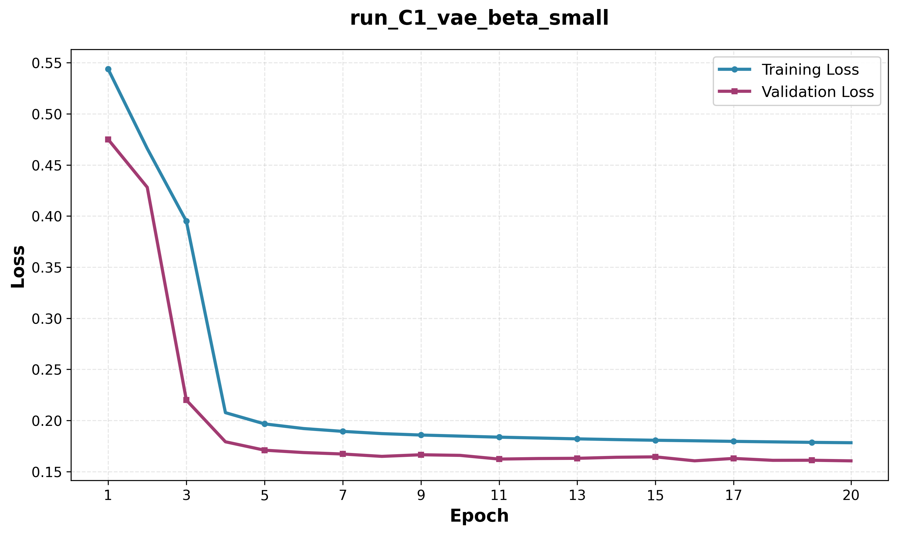

---

### Model C2: VAE (Medium Beta)

#### Architecture
Same as Model C1.

#### Hyperparameters

| Parameter | Value |
|-----------|-------|
| Epochs | 20 |
| Batch Size | 8 |
| Learning Rate | 2e-4 |
| Optimizer | Adam |
| Loss Function | L1 + KL Divergence |
| KLD Weight (β) | 0.001 |

#### Loss Curves

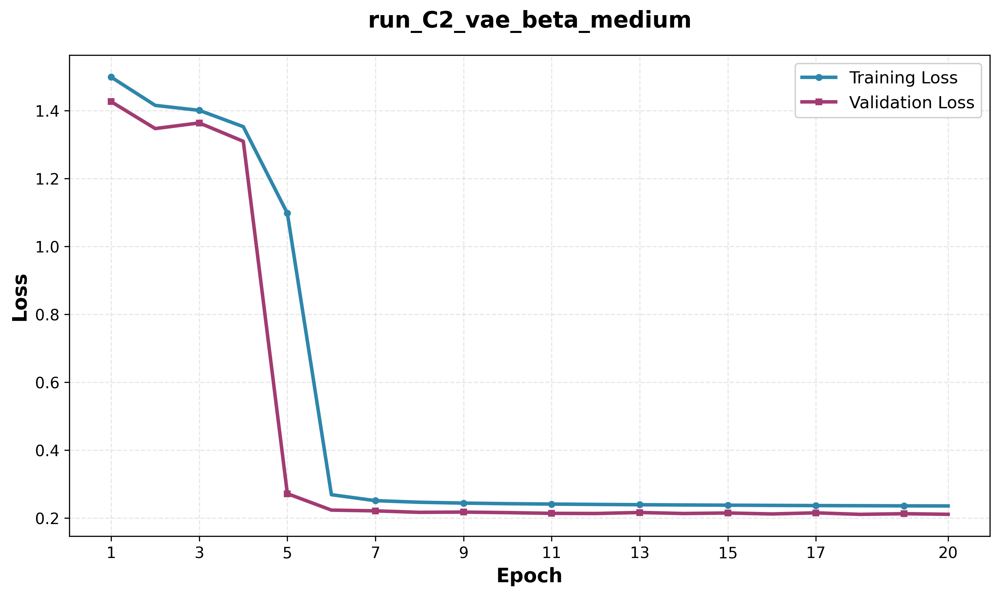

---

### Model C3: VAE (Large Beta)

#### Architecture
Same as Model C1.

#### Hyperparameters

| Parameter | Value |
|-----------|-------|
| Epochs | 20 |
| Batch Size | 8 |
| Learning Rate | 2e-4 |
| Optimizer | Adam |
| Loss Function | L1 + KL Divergence |
| KLD Weight (β) | 0.01 |

#### Loss Curves

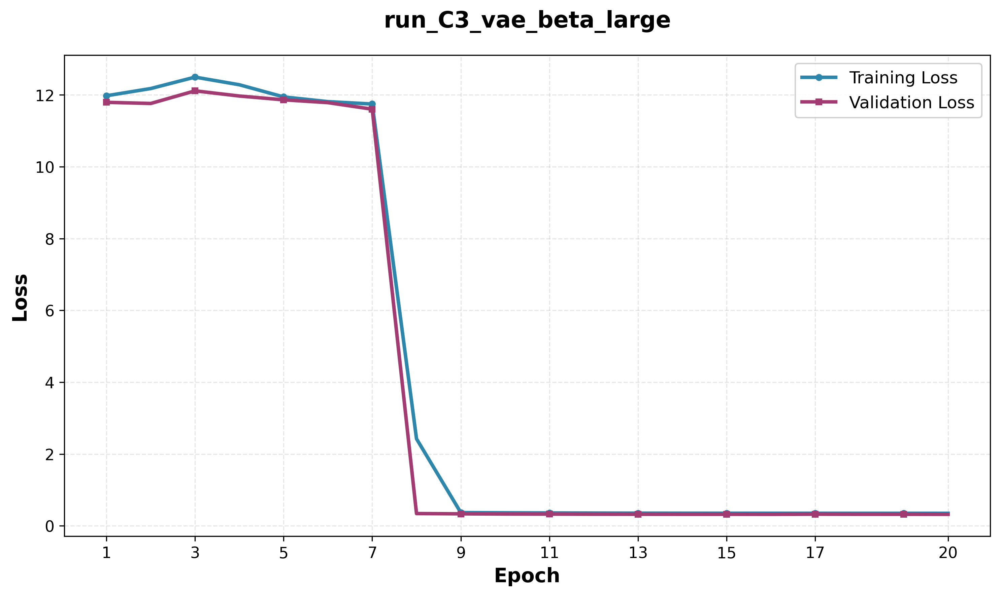

---

### Model C4: VAE (Wide Network)

#### Architecture
- **Model Class**: `VAE`
- **Latent Dimension**: 256
- **Base Channels**: 64 (wider network)
- **Encoder**: 4 convolutional layers
- **Decoder**: 4 transposed convolutional layers

#### Hyperparameters

| Parameter | Value |
|-----------|-------|
| Epochs | 20 |
| Batch Size | 8 |
| Learning Rate | 2e-4 |
| Optimizer | Adam |
| Loss Function | L1 + KL Divergence |
| KLD Weight (β) | 0.00025 |

#### Loss Curves

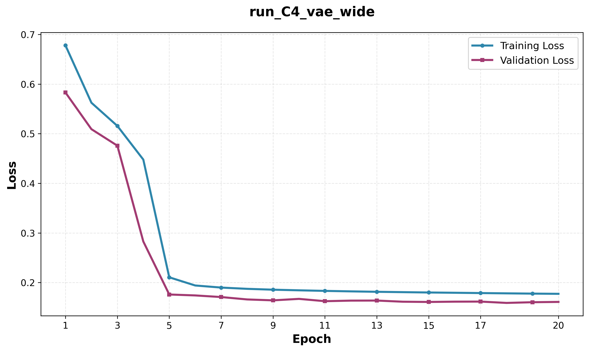

---

### Model C5: VAE + LPIPS

#### Architecture
Same as Model C1 (base channels = 32).

#### Hyperparameters

| Parameter | Value |
|-----------|-------|
| Epochs | 20 |
| Batch Size | 8 |
| Learning Rate | 2e-4 |
| Optimizer | Adam |
| Loss Function | L1 + KL Divergence + LPIPS |
| KLD Weight (β) | 0.00025 |
| LPIPS Weight | 0.1 |

#### Loss Curves

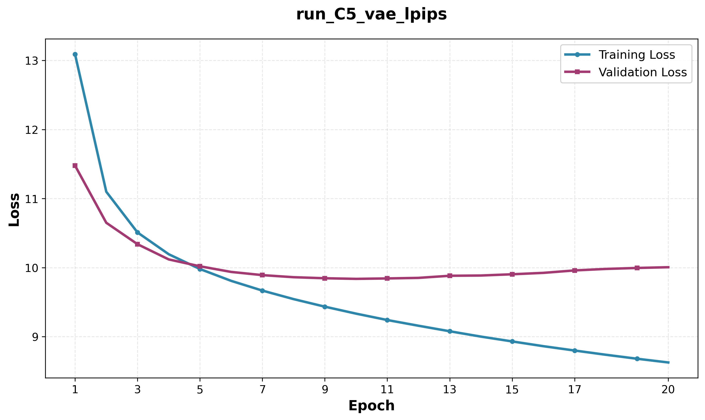

---

## Part D: Deep VAE with Attention

This section presents advanced models combining deep ResNet architectures with self-attention mechanisms and VAE regularization.

### Model D1: Deep ResNet VAE

#### Architecture
- **Model Class**: `DeepResNetVAE`
- **Latent Dimension**: 256
- **Encoder**: 5 downsampling blocks with ResBlocks
- **Decoder**: 5 upsampling blocks with ResBlocks
- **Normalization**: BatchNorm
- **Activation**: LeakyReLU (0.2)

#### Hyperparameters

| Parameter | Value |
|-----------|-------|
| Epochs | 30 |
| Batch Size | 4 |
| Learning Rate | 2e-4 |
| Optimizer | Adam |
| Loss Function | L1 + KL Divergence |
| KLD Weight (β) | 0.00025 |

#### Loss Curves

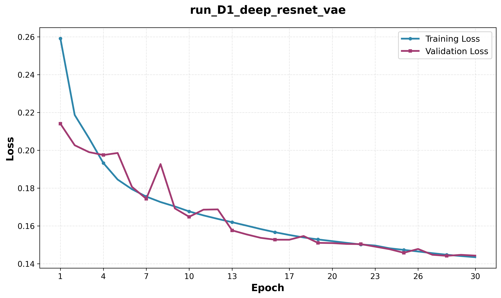

---

### Model D2: Deep ResNet VAE + LPIPS

#### Architecture
Same as Model D1.

#### Hyperparameters

| Parameter | Value |
|-----------|-------|
| Epochs | 30 |
| Batch Size | 4 |
| Learning Rate | 2e-4 |
| Optimizer | Adam |
| Loss Function | L1 + KL Divergence + LPIPS |
| KLD Weight (β) | 0.00025 |
| LPIPS Weight | 0.1 |

#### Loss Curves

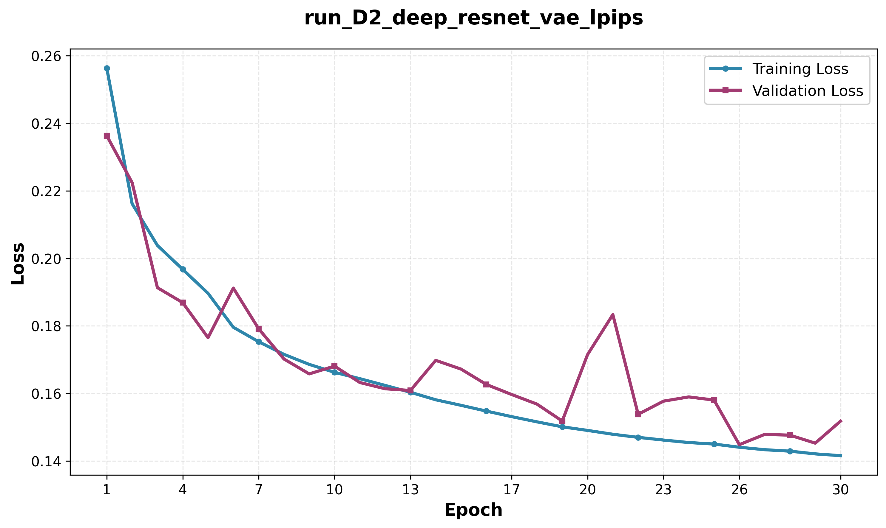

---

### Model D3: Deep ResNet AE + Attention

#### Architecture
- **Model Class**: `DeepResNetAttentionAE`
- **Latent Dimension**: 256
- **Encoder**: 5 downsampling blocks with ResBlocks
- **Decoder**: 5 upsampling blocks with ResBlocks
- **Attention**: Multi-head self-attention at 16×16 and 32×32 resolutions
- **Attention Heads**: 8
- **Normalization**: GroupNorm

#### Hyperparameters

| Parameter | Value |
|-----------|-------|
| Epochs | 30 |
| Batch Size | 4 |
| Learning Rate | 2e-4 |
| Optimizer | Adam |
| Loss Function | L1 Loss |

#### Loss Curves

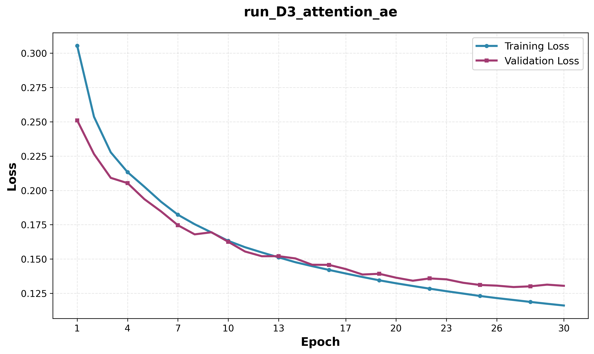

---

## Conclusion

This report presented a comprehensive study of 17 different autoencoder architectures trained on the FFHQ dataset. The models explored various design choices including:

- Skip connections vs. bottleneck architectures
- Different normalization techniques (BatchNorm vs. GroupNorm)
- Activation functions (SiLU, LeakyReLU)
- Perceptual loss (LPIPS) with varying weights
- VAE regularization with different KL divergence weights
- Self-attention mechanisms for capturing global dependencies

The loss curves demonstrate the training dynamics and convergence behavior of each model, providing insights into the effectiveness of different architectural choices and hyperparameter settings.

---

**All code, models, and results are available in the project repository.**
